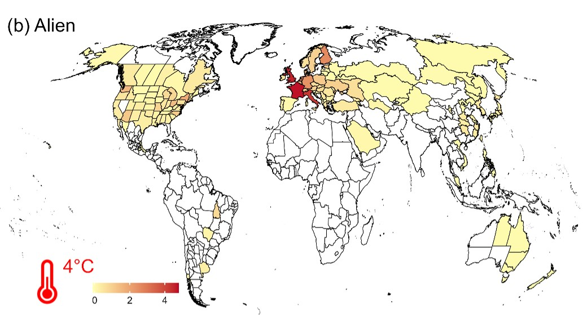

# Forecasting how climate change facilitate invasion of ants and increase their impacts

Forecasting non-native ant richness in different regions under 4°C warming. Red regions indicate larger increases. White regions indicate no increase.

# Overview
This repository contains all the scripts required to reproduce results in Tsang et al. (2024). 
It also contains data to reproduce the results.
Note that because of the size of the climatic raster, they were not uploaded to this repository. Readers can go to to https://www.climatologylab.org/terraclimate.html to download the data.

Nevertheless, data extracted from Terraclimate have been provided, and readers can skip script 1 and 2 and directly run the analyses (clim_invasion_df.csv). 

# Code
Please run these scripts sequentially. To start from the scratch, pick Script 1 (and download Terraclimate rasters, as described in the scripts). If you are interested in the main results only, start from Script 3 and just load the clim_invasion_df.csv

|Scripts|Description|
|---|---|
|1_clim_raster.R| Used to process Terraclimate raster and generate PCA scores (based on climatic conditions) across grids globally. 
|2_GABI_and_Climate| Data cleaning and obtaining climatic conditions in each region, and the native distribution of each species. Also forming the population-level data for analyses. 
|3_Indoor_and_Climate.R| Code for GLMM examining how climatic conditions determine indoor status. Also contain codes for Fig1, and all figures about alien and harmful ant richness.
|4_Impact_analyses.R| Aggregating impact scores from Gruber et al. (2022), and projecting impact increases under climate change. Also contain codes for all figures about the impacts of ants.
|5_Response_capacity.R| Response capacity analyses using data from Early et al. (2016). Also contain codes for figures about response capacitiy.
|6_Socioeconomy.R| Analyzing socioeconomic data at country levels (Fig. S5).
|7_Excel_Table.R| Preparing Table S6.
|make_genus_tree.R| Add missing genera to the phylogenetic tree obtained from Economo et al. (2018). Used in Script 3 for checking phylogenetic autocorrelation.
|eval_georeference.R| Evaluate if it is possible to use geo-referenced records only for the analyses. This is not related to the main results. Run this only after running script 3.

# Data
Some files are too large to be uploaded to GitHub, including the climate rasters from TerraClimate (required for running 1_clim_raster.R) and the Kass et al. (2022) dataset (required for running eval_georeference.R). Please download these files from their respective sources before running the scripts. However, if you are only interested in reproducing the main results, the data available in this repository should be sufficient. You can reproduce the main results by running scripts 3, 4, and 5.

|Data|Description|
|---|---|
|ant_genus_placement.csv| Genera missing from the backbone phylogenetic tree (Economo et al. 2018). 
|backbone_MLtree_RaxML.tre| Backbone tree obtained from (Economo et al. 2018). 
|Bentity2_shapefile_fullres| 546 spatial polygons (i.e., regions) in the analyses. Also available in AntMaps (https://antmaps.org/)
|capacity.csv| Response capacity data from Early et al. (2016). Availabe at https://www.fabiogeography.com/data
|Classification_Mark.csv| Habitat strata data of ants from Wong et al. (2023). 
|clim_invasion_df.csv| Processed data after script 1 & 2, and ready for statistical analyses (scripts 3-5). 
|Exotic_record_date.csv| Alien species records from GABI (Guénard et al. 2017). Visit AntMaps (https://antmaps.org/) for the most updated information.
|GISS.csv| Impact scores of each species obtained from Gruber et al. (2022). We added a column "Health_type" categorizing if the health impacts are only associated with ant attacking people. Non-attack records were excluded from the analyses.
|match_bentity.csv| Some records are associated with names not mentioned in the Bentity2 system. We used this csv file to re-classify them. 
|Native.csv| Native distributions of all ants from GABI (Guénard et al. 2017). Visit AntMaps (https://antmaps.org/) for the most updated information.
|socioeconomy.csv| Data for the socioeconomy analyses at country levels (Fig .S5).

# Figure
The folder contains all figures included in the manuscript.

# Contact
Toby Tsang (paknok.tsang@utoronto.ca)
